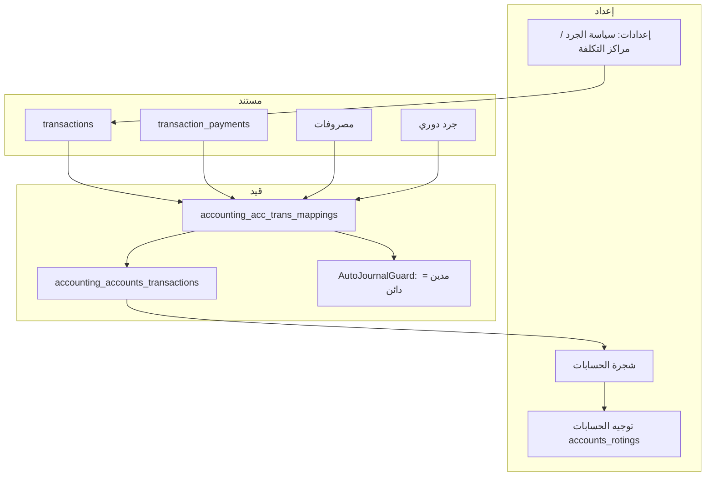
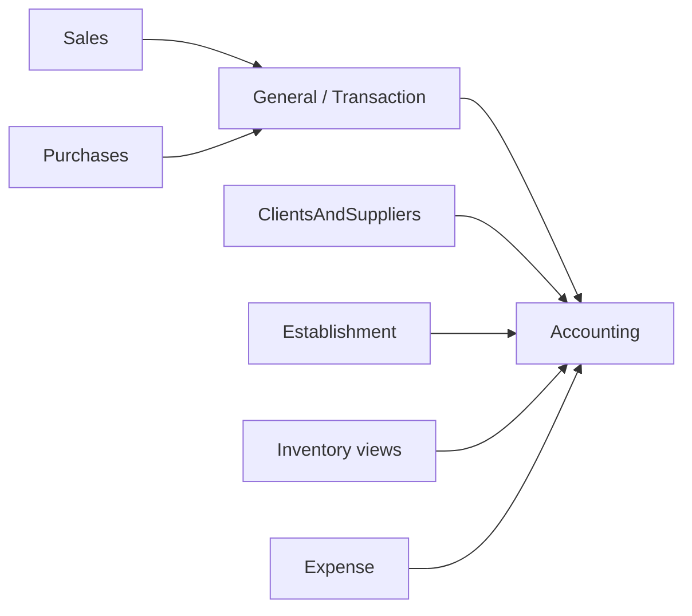
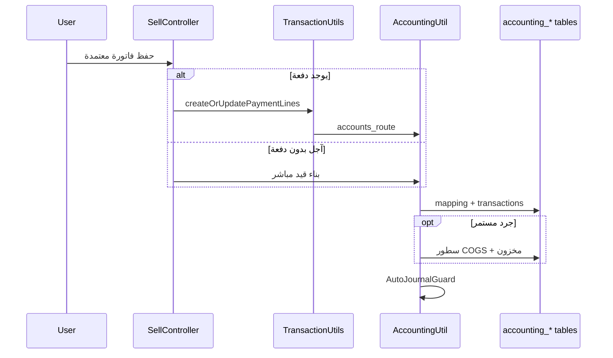

# دليل نظام المحاسبة — MyBee Company

**الإصدار:** 1.0  
**التاريخ:** 2026-06-01  
**المسار:** `Modules/Accounting`  
**النطاق:** تطبيق Laravel متعدد المستأجرين (Stancl Tenancy) — كل مستأجر له قاعدة بيانات منفصلة وترحيلات `tenant`.

---

## 1. ملخص تنفيذي

وحدة المحاسبة في MyBee هي **نظام قيد مزدوج (Double Entry)** مدمج مع:

| الوحدة | الدور |
|--------|--------|
| **المبيعات** (`Sales`) | ترحيل فواتير البيع، المردودات، التحصيل |
| **المشتريات** (`Purchases`) | ترحيل فواتير الشراء والمردودات |
| **العملاء والموردين** (`ClientsAndSuppliers`) | حساب فرعي لكل عميل/مورد (`Contact.account_id`) |
| **المخزون** (`Inventory` + إعدادات عامة) | جرد مستمر (COGS + مخزون) أو جرد دوري (فترات + قيد تسوية) |
| **المصروفات** (`Expense`) | قيود مصروفات تلقائية |
| **الفروع** (`Establishment`) | حساب مخزون مرتبط بالفرع في الجرد المستمر |

**المحرك المركزي:** `Modules/Accounting/Utils/AccountingUtil.php` — توليد القيود التلقائية، شجرة الحسابات الافتراضية، التقارير، أعمار الديون.

**لا يوجد** في الوحدة حالياً: Jobs، Events، Listeners، أو قفل فترات محاسبية على مستوى السيرفر.

---

## 2. هيكل الوحدة

```
Modules/Accounting/
├── Http/Controllers/          # واجهات الويب
│   ├── Api/                     # قوائم حسابات/مراكز تكلفة (JSON)
│   ├── TreeAccountsController   # شجرة الحسابات
│   ├── JournalEntryController   # قيود يومية يدوية
│   ├── AccountsRoutingController
│   ├── PaymentVouchersController / ReceiptVouchersController
│   ├── AccountingReportsController
│   ├── PeriodicInventoryController
│   ├── AccountingSettingsController
│   └── AccountingDashboardController
├── Models/                      # 8 نماذج Eloquent
├── Utils/                       # منطق الأعمال الأساسي
├── Services/                    # خدمات تقارير (ميزان، تدفقات، كشف حساب)
├── classes/                     # تصدير Excel/PDF
├── Exports/                     # جرد دوري Excel
├── routes/web.php, api.php
├── resources/views/             # Blade
├── resources/lang/ar|en/
└── database/migrations/tenant/  # جداول المستأجر

public/modules/accounting/js/
├── financial-year-settings.js   # سنة مالية (متصفح فقط)
└── fiscal-periods.js            # فترات مالية (متصفح فقط)
```

**التسجيل:** `Modules/Accounting/Providers/AccountingServiceProvider` عبر `module.json`.

---

## 3. نموذج البيانات (الجداول)

### 3.1 شجرة الحسابات

| الجدول | النموذج | الوصف |
|--------|---------|--------|
| `accounting_account_types` | `AccountingAccountTypes` | أنواع رئيسية/فرعية (`sub_type`, `detail_type`) |
| `accounting_accounts` | `AccountingAccount` | الحسابات: `gl_code`, `account_primary_type`, `parent_id`, `status`, `account_category` |

**أنواع الحساب الرئيسية (`account_primary_type`):**

- `asset` — أصول  
- `liabilities` — خصوم  
- `equity` — حقوق ملكية  
- `income` — إيرادات  
- `expenses` — مصروفات  

**فئات خاصة (`account_category`):** مثل `inventory`, `COGS`, `inventory_adjustment` — تُستخدم في الجرد المستمر والدوري.

### 3.2 القيود والدفتر

| الجدول | النموذج | الوصف |
|--------|---------|--------|
| `accounting_acc_trans_mappings` | `AccountingAccTransMapping` | **رأس القيد:** `ref_no`, `type`, `operation_date`, `note`, `is_manual`, `path_file` |
| `accounting_accounts_transactions` | `AccountingAccountsTransaction` | **سطور القيد:** `type` (debit/credit), `amount`, `accounting_account_id`, روابط |

**روابط السطر:**

- `transaction_id` — فاتورة مبيعات/مشتريات  
- `transaction_payment_id` — دفعة مرتبطة بفاتورة  
- `acc_trans_mapping_id` — رأس القيد  
- `cost_center_id` — مركز تكلفة (اختياري)  
- `sub_type` — نوع العملية (`journal_entry`, `sell`, `receipt_voucher`, …)

### 3.3 توجيه الحسابات (Routing)

| الجدول | النموذج |
|--------|---------|
| `accounts_rotings` | `AccountsRoting` |

يربط **مفتاح منطقي** بحساب GL فعلي:

| الحقل | مثال |
|-------|------|
| `type` | `sales_sales`, `purchases_vat_calculation`, `periodic_inventory_adjustment` |
| `section` | `sales`, `purchases`, `periodic_inventory` |
| `account_id` | معرّف من `accounting_accounts` |
| `direction` | `auto_assign` |

### 3.4 مراكز التكلفة والجرد الدوري

| الجدول | النموذج |
|--------|---------|
| `accounting_cost_centers` | `AccountingCostCenter` |
| `periodic_inventories` | `PeriodicInventory` |
| `periodic_inventory_items` | `PeriodicInventoryItem` |

---

## 4. تدفق القيد المحاسبي



### 4.1 رقم المرجع

يُولَّد عبر `AccountingUtil::generateReferenceNumber()` بصيغة مثل: `YYYY/0001`.

### 4.2 القيود اليدوية vs التلقائية

| `is_manual` | المصدر |
|-------------|--------|
| `1` | شاشة **القيود اليومية** — `JournalEntryController` + `JournalEntryValidator` |
| `0` | فواتير، مدفوعات، مصروفات، جرد دوري |

### 4.3 معادلة الرصيد في التقارير

`AccountingUtil::balanceFormula()` — توحيد إشارة الرصيد حسب نوع الحساب (أصل/خصم/إيراد/مصروف) ونوع السطر (مدين/دائن).

---

## 5. ترحيل المستندات التجارية

### 5.1 نقطة الدخول المشتركة

`Modules/General/Utils/TransactionUtils.php`:

- `createOrUpdatePaymentLines()` — عند وجود دفعة على الفاتورة يستدعي `AccountingUtil::accounts_route()`.
- `addPaymentLines_journalEntry()` — سند قبض/صرف **مرتبط بفاتورة** (تسوية ذمة).
- بعد الإنشاء: `AutoJournalGuard::assertBalanced()` — يرفض قيداً غير متوازن.

**استثناء:** مبيعات الوردية (`shift_id` معيّن) قد **لا** تُرحّل محاسبياً عبر نفس المسار.

### 5.2 المبيعات — `SellController`

1. التحقق من توجيه الحسابات وحساب العميل (فاتورة آجلة).
2. إن وُجدت دفعة → `TransactionUtils::createOrUpdatePaymentLines()`.
3. إن لم تُدفع بالكامل (آجل بدون دفعة فورية) → بناء القيد مباشرة في المتحكم.
4. **جرد مستمر:** `appendPerpetualCogsEntries()` / `appendPerpetualInventoryImpactEntries()`:
   - مدين: تكلفة مبيعات (مثلاً GL `50101`)
   - دائن: مخزون (مثلاً GL `1105` أو حساب الفرع)

### 5.3 المشتريات — `PurchasesController`

نفس النمط مع `accounts_route` لقسم `purchases`:

- **جرد مستمر:** بدل حساب المشتريات (`purchases_purchase`) يُستخدم **حساب المخزون** عبر `PerpetualInventoryAccountResolver`.
- **جرد دوري:** يُرحّل على حساب المشتريات/المصروف حسب التوجيه.

### 5.4 المردودات

`SellReturnController`, `PurchasesReturnController` — قيود عكسية عبر نفس مفاتيح التوجيه (`sales_sell_return`, `purchases_purchase_return`).

### 5.5 منطق `accounts_route()` (مختصر)

الملف: `AccountingUtil.php` — الدالة `accounts_route()`.

```text
1. تحديد section: sales | purchases حسب transaction.type
2. إنشاء AccountingAccTransMapping (is_manual = 0)
3. حسب نوع الفاتورة (cash | due) وبيانات العميل/المورد:
   - نقدي: مدين صندوق/بنك، دائن إيراد/مشتريات + ضريبة + خصم
   - آجل: مدين حساب العميل/المورد (Contact.account_id)
4. مردودات: عكس الإشارات
5. إن كان جرداً مستمراً: إلحاق سطور COGS/مخزون
```

**مفاتيح التوجيه الافتراضية** (من `default_accounting_route()`):

| type | section | الغرض |
|------|---------|--------|
| `sales_sales` | sales | إيراد المبيعات |
| `sales_vat_calculation` | sales | ضريبة مخرجات |
| `sales_discount_allowed` | sales | خصم مسموح |
| `purchases_purchase` | purchases | مشتريات / مصروف |
| `purchases_vat_calculation` | purchases | ضريبة مدخلات |
| `purchases_earned_discount` | purchases | خصم مكتسب |
| `periodic_inventory_adjustment` | periodic_inventory | تسوية جرد دوري |

---

## 6. سياسة الجرد (مستمر vs دوري)

**المصدر:** `Modules/General/Models/Setting.php` — مفتاح `inventory_tracking_policy`:

| القيمة | السلوك |
|--------|--------|
| `perpetual` (افتراضي) | COGS + مخزون عند كل بيع/شراء؛ التحقق من الكمية عند البيع |
| `periodic` | لا COGS لحظي؛ **جرد دوري** بنهاية الفترة |

**واجهة الإعداد:** الإعدادات العامة → تبويب سياسة الجرد (`general-setting/inventory_policy_tab`).

### 6.1 الجرد المستمر

- **حساب المخزون:** `PerpetualInventoryAccountResolver::resolveInventoryAssetAccountId($establishmentId)`
  - يبحث في `Establishment.perpetual_inventory_account_id`
  - ثم يصعد سلسلة الفروع الأب
  - ثم حساب فئة `inventory` أو GL `1105`
- **COGS:** حساب فئة `COGS` أو GL `50101`

### 6.2 الجرد الدوري

- **المتحكم:** `PeriodicInventoryController` (مسارات تحت `inventory/periodic-inventory`)
- **يظهر فقط** إذا `Setting::isPeriodicInventory()`
- **الدورة:** إنشاء فترة → عدّ فعلي حسب `establishment_id` → حساب فروقات → **اعتماد** `approve()` → `postInventoryAdjustments()` → قيد تسوية مرتبط بـ `adjustment_entry_id`

---

## 7. السندات والقيود اليدوية

### 7.1 سند قبض / سند صرف مستقل

| الشاشة | المتحكم | `sub_type` | `transaction_payment_id` |
|--------|---------|------------|--------------------------|
| سندات القبض | `ReceiptVouchersController` | `receipt_voucher` | `null` |
| سندات الصرف | `PaymentVouchersController` | `payment_voucher` | `null` |

يُنشئ سطرين متوازيين عبر `StandaloneVoucherHelper`.

### 7.2 تسوية فاتورة (دفعة على فاتورة)

`TransactionUtils::addPaymentLines_journalEntry()` — سطر مدين/دائن بين الصندوق وحساب العميل/المورد مع `transaction_payment_id` معبّأ.

### 7.3 القيود اليومية اليدوية

- قائمة: `journal-entry-index`
- إنشاء/تعديل: `JournalEntryController`
- تحقق: `JournalEntryValidator`
- مرفقات اختيارية على `AccountingAccTransMapping.path_file`

---

## 8. شجرة الحسابات وأكواد GL

### 8.1 الشاشات والمسارات

| الوظيفة | Route name |
|---------|------------|
| الشجرة | `tree-of-accounts` |
| إنشاء حساب | `create-account`, `store-account` |
| دفتر الأستاذ | `ledger`, `print-ledger` |
| استيراد Excel | `tree-of-accounts-import` |
| إصلاح أكواد GL | `tree-of-accounts-repair-gl-codes` |
| الشجرة الافتراضية | `create-default-accounts` |

### 8.2 قواعد توليد `gl_code`

في `AccountingUtil`:

- تحت نوع رئيسي برقم واحد (`1`, `2`, …): الفرعي يضيف **رقماً واحداً** (`11`, `21`, …).
- المستويات الأعمق: **رقمان** (`01`, `02`) → مثال: `1101`, `1102`, `2101`.
- مصروفات تحت `5`: أول مستوى بثلاثة أرقام (`501`, `502`).

**إصلاح الأكواد:** `GlCodeRepairService` + زر في الواجهة.

### 8.3 bootstrap افتراضي

`TreeAccountsController::createDefaultAccounts()`:

1. `AccountingUtil::default_accounting_account_types()`
2. `AccountingUtil::Default_Accounts()`
3. `AccountingUtil::default_accounting_route()`

> ملاحظة: ملفات `GeneralTreeAccUtil`, `RestaurantCafeAccUtil`, … موجودة لكن المسار النشط يعتمد على `AccountingUtil` فقط (حسب نوع النشاط كان معطّلاً في الكود).

---

## 9. الإعدادات المحاسبية

### 9.1 صفحة الإعدادات

`accounting-settings` → `AccountingSettingsController`

| التبويب | التخزين |
|---------|---------|
| السنة المالية | **localStorage** في المتصفح (`bee_accounting_financial_years_v1`) — **لا يُحفظ في قاعدة البيانات** |
| الفترات المالية | نفس الأمر (`fiscal-periods.js`) — **لا يمنع الترحيل في PHP** |
| توجيه الحسابات | `accounts_rotings` عبر `accounts-routing-store` |

### 9.2 إعدادات عامة مرتبطة

| المفتاح | التأثير |
|---------|---------|
| `inventory_tracking_policy` | مستمر / دوري |
| `inventory_costing_method` | طريقة التكلفة |
| `toggleCost_center` | إظهار مراكز التكلفة |
| عملة النظام | عرض التقارير |

---

## 10. التقارير المالية

**البوابة:** `accounting-reports` → `AccountingReportsController::index`

| التقرير | Route | خدمة/تصدير |
|---------|-------|------------|
| قائمة الدخل | `income-statement` | `IncomeStatementExport` |
| ميزان المراجعة | `trial-balance` | `TrialBalanceReportService` |
| الميزانية العمومية | `balance-sheet` | `BalanceSheetExport` |
| تقرير القيود | `journal-report` | `JournalReportExport` |
| التدفقات النقدية | `cash-flow` | `CashFlowReportService` |
| كشف عملاء/موردين | `customers-suppliers-statement` | `CustomerSupplierStatementReportService` |
| أعمار الذمم (مدينة/دائنة) | `account-receivable-ageing-*`, `account-payable-ageing-*` | `AgeingSummaryExport`, … |
| تقرير المصروفات | `expense-report` | تكامل مع `Expense` |

**إضافي:** لوحة `accounting-dashboard`، دفتر حساب، حركة مركز تكلفة.

---

## 11. التكامل مع الوحدات الأخرى



| الوحدة | الملفات الرئيسية |
|--------|------------------|
| General | `Transaction`, `TransactionPayments`, `TransactionUtils` |
| Clients | `Contact.account_id`, `ContactUtils` |
| Establishment | `perpetual_inventory_account_id` |
| Expense | `ExpenseJournalPoster`, `ExpenseReportService` |
| Employee | `dashboard-permissions.php` — صلاحيات `accounting.*`, `accountingReports.*` |
| Menu | `config/menu.php` |

**API مساعدة (بدون auth في الملف):**

- `GET api/accounts`
- `GET api/cost-centers`

---

## 12. الصلاحيات والأمان

### 12.1 Middleware على المسارات

- `InitializeTenancyByDomain`, `PreventAccessFromCentralDomains`
- `auth` على معظم مسارات المحاسبة
- `accounting-dashboard` **خارج** مجموعة `auth` (راجع إن كان مقصوداً)
- `throttle:6,1` على: إعادة تعيين staging، إصلاح GL

### 12.2 الصلاحيات

تُعرَّف في `Modules/Employee/data/dashboard-permissions.php`، وتُطبَّق غالباً عبر **القائمة والـ Blade** (`hasDashboardPermission`) وليس middleware على كل متحكم.

أمثلة:

- `accounting.Accounts tree.*`
- `accounting.Daily entries.*`
- `accounting.Receipt vouchers.*`
- `accountingReports.trial balance.show`

### 12.3 إعادة تعيين كاملة (Staging)

`POST accounting/staging-full-reset` — يتطلب:

- `confirm=RESET_ACCOUNTING_FULL`
- `ACCOUNTING_ALLOW_FULL_RESET=true` أو `APP_ENV=local|staging`

ينفّذ `AccountingFullResetService::truncateAndReseedDefaults()`.

---

## 13. مسارات الويب (مرجع سريع)

ملف كامل: `Modules/Accounting/routes/web.php`

| المجموعة | أمثلة |
|----------|--------|
| شجرة الحسابات | `tree-of-accounts`, `ledger`, `create-default-accounts` |
| إعدادات | `accounting-settings`, `accounts-routing` |
| قيود | `journal-entry-*` |
| مراكز تكلفة | `cost-center-*` |
| سندات | `receipt-vouchers`, `payment-vouchers` |
| تقارير | `income-statement`, `trial-balance`, … |
| جرد دوري | `inventory/periodic-inventory` |

---

## 14. ملفات مرجعية للمطورين

| الموضوع | الملف |
|---------|--------|
| ترحيل تلقائي | `Modules/Accounting/Utils/AccountingUtil.php` |
| توازن القيد | `Modules/Accounting/Utils/AutoJournalGuard.php` |
| دفعات الفواتير | `Modules/General/Utils/TransactionUtils.php` |
| مخزون مستمر | `Modules/Accounting/Utils/PerpetualInventoryAccountResolver.php` |
| سندات مستقلة | `Modules/Accounting/Utils/StandaloneVoucherHelper.php` |
| قيود يدوية | `Modules/Accounting/Http/Controllers/JournalEntryController.php` |
| شجرة الحسابات | `Modules/Accounting/Http/Controllers/TreeAccountsController.php` |
| جرد دوري | `Modules/Accounting/Http/Controllers/PeriodicInventoryController.php` |
| سياسة الجرد | `Modules/General/Models/Setting.php` |
| الصلاحيات | `Modules/Employee/data/dashboard-permissions.php` |

---

## 15. قيود معروفة ونقاط انتباه

1. **السنة والفترات المالية** واجهة تنظيمية في المتصفح فقط — لا تُستخدم كفلتر إلزامي عند `store` للقيود.
2. **`JournalEntryUtil.php`** فارغ — كل المنطق في `AccountingUtil`.
3. **لا أحداث (Events) ولا طوابير** للمحاسبة داخل الوحدة.
4. **قائمة الجرد الدوري** في القائمة قد تشترك صلاحية مع سندات الصرف (placeholder).
5. **فاتورة آجلة:** يجب ربط `Contact.account_id` وإلا `RuntimeException`.
6. **جرد مستمر:** يجب ضبط توجيه المشتريات أو حساب مخزون الفرع (`1105`).
7. **مبيعات الوردية** قد تتخطى الترحيل المحاسبي حسب `shift_id`.

---

## 16. تشغيل وصيانة

```bash
# ترحيلات مستأجر (بعد إضافة migrations جديدة)
php artisan tenants:migrate

# إصلاح أكواد GL من الواجهة أو:
# POST tree-of-accounts/repair-gl-codes
```

**بعد تغيير شجرة افتراضية:** استخدم `create-default-accounts` بحذر على بيئة فيها بيانات فعلية (يُعيد تعيين التوجيهات عبر `truncate` على `accounts_rotings` في المسار الافتراضي).

---

## 17. مخطط دورة حياة فاتورة بيع (مثال)



---

*هذا المستند يصف الحالة الحالية للكود في المستودع. عند إضافة ميزات (مثلاً قفل فترات على السيرفر)، يُحدَّث هذا الملف accordingly.*
