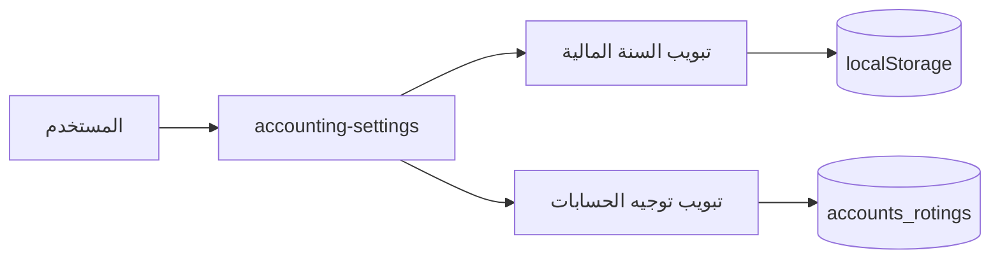
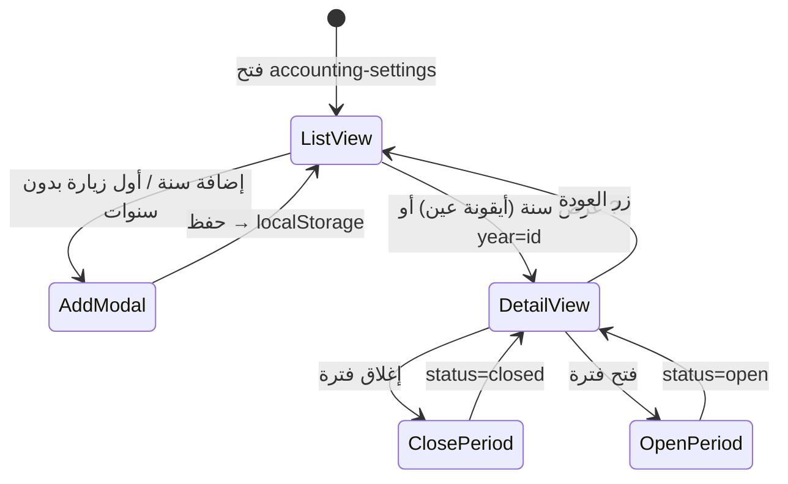
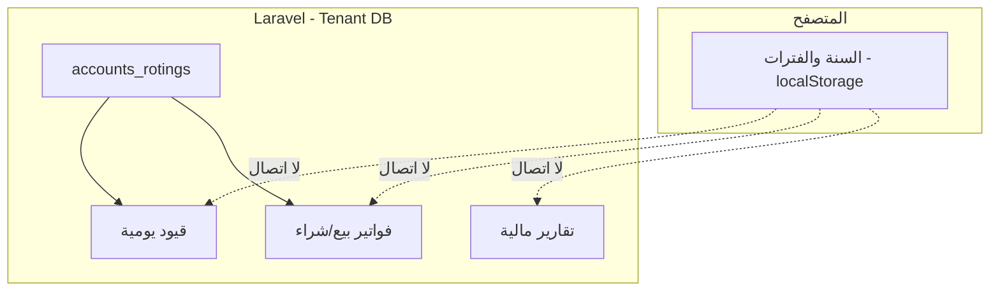

# الفترات المالية والسنة المالية — MyBee Company

**الإصدار:** 1.0  
**التاريخ:** 2026-06-01  
**الصفحة:** `accounting-settings` → تبويب **السنة المالية**  
**المسار:** `Modules/Accounting` + `public/modules/accounting/js/`

---

## 1. ملخص سريع

| البند | الواقع في النظام الحالي |
|--------|-------------------------|
| أين تُعرَّف؟ | واجهة **إعدادات المحاسبة** فقط |
| أين تُخزَّن؟ | **`localStorage`** في متصفح المستخدم — **ليست في قاعدة البيانات** |
| مفتاح التخزين | `bee_accounting_financial_years_v1` |
| API خلفي | **لا يوجد** — `AccountingSettingsController` يعرض الصفحة فقط ولا يحفظ سنوات/فترات |
| تأثير على القيود | **لا يوجد** — ترحيل الفواتير والقيود في PHP **لا يقرأ** السنة أو الفترة المفتوحة |
| الفترات | تُولَّد **شهرياً** تلقائياً داخل كل سنة مالية |
| إجراء الفترة | **فتح / إغلاق** (تغيير `status` في JSON المحلي فقط) |

> **مهم للمطورين والمحاسبين:** هذه الشاشة أداة **تنظيمية وإرشادية** داخل المتصفح. إغلاق فترة هنا **لا يمنع** إنشاء فاتورة أو قيد يومي في نفس التاريخ من باقي النظام.

---

## 2. أين تجد الشاشة؟

| العنصر | القيمة |
|--------|--------|
| Route | `accounting-settings` |
| URL مع تبويب | `?tab=financial-year` (افتراضي) |
| تبويب آخر | `?tab=accounts-routing` (توجيه الحسابات — **يُحفظ في DB**) |
| المتحكم | `AccountingSettingsController::index()` |
| العرض الرئيسي | `resources/views/settings/index.blade.php` |
| محتوى السنة | `@include('accounting::settings.financial-year')` |
| تفاصيل الفترات | `resources/views/settings/financial-year-detail.blade.php` |



---

## 3. بنية التخزين (JSON)

كل البيانات في مفتاح واحد:

```text
localStorage['bee_accounting_financial_years_v1']
```

### 3.1 الشكل العام

```json
{
  "firstSaved": true,
  "years": [
    {
      "id": "fy_1717234567890",
      "start_date": "2026-01-01",
      "end_date": "2026-12-31",
      "description": "السنة المالية 2026",
      "status": "open",
      "created_at": "2026-06-01T10:00:00.000Z",
      "periods": [
        {
          "id": "p_0_20260101",
          "name": "يناير 2026",
          "start_date": "2026-01-01",
          "end_date": "2026-01-31",
          "status": "open"
        }
      ]
    }
  ]
}
```

### 3.2 حقول السنة المالية

| الحقل | النوع | الوصف |
|-------|--------|--------|
| `id` | string | يُنشأ عند الإضافة: `fy_` + `Date.now()` |
| `start_date` | string | `YYYY-MM-DD` |
| `end_date` | string | `YYYY-MM-DD` — يجب ≥ البداية |
| `description` | string | اختياري؛ إن فُرغ يُولَّد من سنة النهاية |
| `status` | `open` \| `closed` | حالة السنة (انظر التطبيع أدناه) |
| `created_at` | ISO string | وقت الإنشاء |
| `periods` | array | الفترات الشهرية |

### 3.3 حقول الفترة

| الحقل | النوع | الوصف |
|-------|--------|--------|
| `id` | string | `p_{index}_{YYYYMMDD}` من تاريخ بداية الفترة |
| `name` | string | اسم الشهر (عربي/إنجليزي حسب `locale`) |
| `start_date` | string | أول يوم في الفترة |
| `end_date` | string | آخر يوم (نهاية الشهر أو نهاية السنة) |
| `status` | `open` \| `closed` | فتح/إغلاق يدوي من الواجهة |

### 3.4 تطبيع الحالات

في `financial-year-settings.js` و `fiscal-periods.js`:

- `closing` → تُعامل كـ **`closed`**
- أي قيمة أخرى للفترة/السنة → **`open`**

نصوص `period_status_closing` و `period_status_upcoming` موجودة في ملفات اللغة لكن **لا يُنشئها الكود حالياً** ولا يُطبَّق عليها منع إدخال.

---

## 4. الملفات والمسؤوليات

| الملف | الدور |
|-------|--------|
| `public/modules/accounting/js/financial-year-settings.js` | تحميل/حفظ `localStorage`، إدارة السنوات، توليد الفترات، لوحة «السنة الحالية»، الجدول التاريخي |
| `public/modules/accounting/js/fiscal-periods.js` | عرض تفاصيل سنة، جدول الفترات، فتح/إغلاق فترة، ترقيم الصفحات، بحث وفرز |
| `resources/views/settings/index.blade.php` | تمرير `window.fySettingsConfig` (رسائل + `storageKey` + `locale`) |
| `resources/lang/ar/financial_year.php` | نصوص عربية |
| `resources/lang/en/financial_year.php` | نصوص إنجليزية |

### 4.1 واجهة JavaScript العامة

بعد التحميل:

```javascript
window.fySettingsApi = {
  loadState, saveState, parseDate, formatDisplayDate,
  statusBadgeHtml, escapeHtml, ensureYearPeriods,
  refreshUi, getState,
  openYearDetail, closeYearDetail,
  cfg, msg
};

window.FyFiscalPeriods = {
  showDetailView, showListView
};
```

ترتيب تحميل السكربتات في الصفحة:

1. `fiscal-periods.js`
2. `financial-year-settings.js` (يُكمّل الربط مع `FyFiscalPeriods`)

---

## 5. توليد الفترات الشهرية

الدالة: `generatePeriodsForYear(startStr, endStr)` في `financial-year-settings.js`.

```text
1. cursor = تاريخ بداية السنة
2. طالما cursor <= نهاية السنة:
   - periodStart = cursor
   - periodEnd = آخر يوم في نفس الشهر (أو نهاية السنة إن سبق)
   - إضافة فترة بحالة open افتراضياً
   - cursor = اليوم التالي لـ periodEnd
3. إرجاع المصفوفة
```

**خصائص:**

- الفترة **ليست بالضرورة 12 شهراً** إذا كانت السنة أقصر أو أطول من سنة ميلادية كاملة.
- الشهر الأول قد يكون جزئياً (من `start_date` حتى آخر ذلك الشهر).
- الشهر الأخير قد ينتهي عند `end_date` وليس آخر يوم تقويمي للشهر.
- اسم الفترة: `toLocaleDateString` بصيغة شهر + سنة (`ar-SA` أو `en-US`).

**إعادة التوليد:** عند **تعديل** تواريخ السنة في نافذة التعديل، إذا تغيّرت `start_date` أو `end_date` → تُستبدل مصفوفة `periods` بالكامل (تُفقد حالات الإغلاق السابقة لتلك الفترات).

---

## 6. واجهة المستخدم — تدفق العمل



### 6.1 عرض القائمة (`fy-years-list-view`)

| منطقة | العنصر | الوظيفة |
|--------|--------|---------|
| أعلى | بطاقات إحصاء | **السنة الحالية** = أول سنة `status=open`، وإلا آخر سنة في المصفوفة |
| أسفل | جدول السجل | كل السنوات مرتبة من الأحدث بدايةً |
| أزرار | إضافة سنة | يفتح `#fyYearAddModal` |
| صف | عرض / تعديل / حذف | عرض → تفاصيل الفترات؛ حذف مع SweetAlert |

**أول زيارة بدون بيانات:** يُفتح modal الإضافة تلقائياً.

### 6.2 إضافة سنة (`#fyYearAddModal`)

| حقل | تحقق |
|------|------|
| `start_date`, `end_date` | مطلوب، `YYYY-MM-DD`، النهاية ≥ البداية |
| `status` | `open` أو `closed` |
| `description` | اختياري |

بعد الحفظ: `generatePeriodsForYear` → `push` إلى `state.years` → `saveState`.

### 6.3 تفاصيل السنة والفترات (`#fy-year-detail-view`)

| ميزة | التفاصيل |
|------|-----------|
| الدخول | زر «عرض» أو `?year={id}` في الرابط |
| عمود جانبي | وصف السنة، البداية، النهاية، الحالة |
| جدول الفترات | 10 فترات لكل صفحة (`PAGE_SIZE = 10`) |
| بحث | بالاسم أو التواريخ (نصي) |
| فرز | بالاسم، البداية، النهاية، الحالة |
| إجراء | فترة **مفتوحة** → زر قفل (إغلاق)؛ **مغلقة** → زر فتح |

رسائل التأكيد: SweetAlert2 إن وُجد، وإلا `confirm()` المتصفح.

### 6.4 تعديل وحذف السنة

- **تعديل:** `#fyYearEditModal` — تغيير التواريخ يعيد بناء الفترات كما في §5.
- **حذف:** يزيل السنة من `years`؛ إن كانت معروضة في التفاصيل يُغلق عرض التفاصيل.

---

## 7. ما الذي لا يفعله النظام (فجوات مقصودة / قيد حالي)

| المتوقع أحياناً | الواقع |
|-----------------|--------|
| منع قيد بتاريخ في فترة مغلقة | **غير مُنفَّذ** في `JournalEntryController`, `SellController`, `PurchasesController`, … |
| فلترة التقارير حسب الفترة المفتوحة | التقارير تستخدم **فلاتر تاريخ** عادية وليس `localStorage` |
| مشاركة السنوات بين المستخدمين | كل متصفح/جهاز له نسخته الخاصة من `localStorage` |
| مزامنة بين الفروع | لا |
| نسخ احتياطي مع قاعدة البيانات | لا — مسح بيانات المتصفح = فقدان الإعداد |
| إقفال سنة يغلق كل الفترات تلقائياً | **لا** — حالة السنة وحالة كل فترة **مستقلتان** في JSON |
| API لجلب «الفترة النشطة» | لا |

نص واجهة مثل *«لن يُسمح بإدخال قيود جديدة ضمنها»* (`confirm_close_text`) يصف **نية المنتج**؛ التطبيق الفعلي على باقي الوحدات **لم يُربط بعد**.

---

## 8. الفرق بين «الفترة المالية» و«الجرد الدوري»

| | الفترات المالية (هذا المستند) | الجرد الدوري (`periodic_inventories`) |
|--|-------------------------------|--------------------------------------|
| التخزين | `localStorage` | جداول MySQL |
| الغرض | تنظيم السنة والأشهر في الإعدادات | عدّ مخزون وقيد تسوية |
| الربط بالمحاسبة | لا | نعم — `PeriodicInventoryController::approve()` |
| الإعداد | تبويب السنة المالية | `inventory_tracking_policy = periodic` |

لا تخلط بينهما عند التوثيق أو التدريب.

---

## 9. التكامل مع بقية المحاسبة



**ما يعمل فعلياً على السيرفر:**

- `operation_date` على `accounting_acc_trans_mappings` / `accounting_accounts_transactions` = تاريخ العملية من الفاتورة أو القيد.
- لا حقل `fiscal_period_id` في جداول المحاسبة الحالية.

للتفاصيل الكاملة عن الترحيل والتقارير راجع: [`docs/accounting-module-ar.md`](accounting-module-ar.md).

---

## 10. التوطين والإعدادات الأمامية

يُبنى `fySettingsConfig` في Blade:

```javascript
window.fySettingsConfig = {
  locale: 'ar' | 'en',
  storageKey: 'bee_accounting_financial_years_v1',
  messages: { /* مفاتيح من accounting::financial_year.* */ }
};
```

**عرض التاريخ:**

- عربي: `DD/MM/YYYY`
- إنجليزي: `YYYY-MM-DD`

**التقويم:** Flatpickr مع locale عربي عند `app()->getLocale() === 'ar'`.

---

## 11. عناوين URL مفيدة

| الحالة | مثال |
|--------|------|
| إعدادات — سنة مالية | `/accounting-settings` أو `?tab=financial-year` |
| إعدادات — توجيه حسابات | `/accounting-settings?tab=accounts-routing` |
| تفاصيل سنة (عميق) | `/accounting-settings?year=fy_1717234567890` |

معامل `year` يُحدَّث عبر `history.replaceState` عند الدخول/الخروج من عرض التفاصيل.

---

## 12. صلاحيات الوصول

الصفحة ضمن مسارات المحاسبة المحمية بـ `auth` + tenancy.

صلاحيات القائمة (من `config/menu.php` و `dashboard-permissions.php`) مرتبطة بإعدادات المحاسبة عموماً — **لا توجد** صلاحية منفصلة لكل فترة.

التحقق في المتحكمات **غير مفعّل بشكل صارم** على مستوى كل إجراء؛ يعتمد على إخفاء عناصر القائمة حسب صلاحيات المستخدم.

---

## 13. صيانة وتطوير مستقبلي

### 13.1 إن أردت ربط الفترات بالقيود (اقتراح معماري)

1. جداول tenant: `fiscal_years`, `fiscal_periods` (`status`, `start_date`, `end_date`).
2. API: `GET/POST` من `AccountingSettingsController` أو متحكم مخصص.
3. Middleware أو Validator: عند `store` قيد/فاتورة — `operation_date` داخل فترة `open`.
4. ترحيل بيانات: قراءة `localStorage` مرة واحدة عند أول دخول بعد التحديث (اختياري).

### 13.2 تغيير مفتاح التخزين

إذا غيّرت `storageKey` في `index.blade.php`، المستخدمون **يفقدون** البيانات القديمة ما لم تُنفّذ أداة ترحيل.

### 13.3 إصدار السكربت

الصفحة تحمّل:

```html
fiscal-periods.js?v=5
financial-year-settings.js?v=7
```

ارفع رقم `v` بعد أي تعديل لتفادي كاش المتصفح.

---

## 14. مرجع سريع للمطور

| المهمة | أين |
|--------|-----|
| تغيير منطق توليد الأشهر | `generatePeriodsForYear` في `financial-year-settings.js` |
| تغيير حجم صفحة الفترات | `PAGE_SIZE` في `fiscal-periods.js` |
| نصوص الواجهة | `Modules/Accounting/resources/lang/*/financial_year.php` |
| إضافة حقل للسنة | JSON + نماذج Blade + `bindForm` / `bindYearEditForm` |
| ربط بالسيرفر | **غير موجود** — يتطلب تصميم جداول + API جديد |

---

## 15. أسئلة شائعة

**س: أغلقت يناير من الشاشة، لماذا ما زلت أُنشئ فاتورة بتاريخ 15/1؟**  
ج: لأن الإغلاق محلي في المتصفح فقط ولا يصل لمنطق حفظ الفواتير.

**س: زميلي لا يرى سنواتي المالية.**  
ج: البيانات في `localStorage` لمتصفحك أنت، وليست على السيرفر.

**س: غيّرت تواريخ السنة وفقدت حالة إغلاق بعض الأشهر.**  
ج: متوقع — إعادة توليد `periods` تستبدل المصفوفة بالكامل.

**س: هل «السنة المغلقة» تمنع القيود؟**  
ج: لا على مستوى PHP حالياً؛ هي علامة عرض/تنظيم فقط.

**س: أين أضبط سياسة الجرد (مستمر/دوري)؟**  
ج: الإعدادات العامة للنظام — `inventory_tracking_policy` — وليس من شاشة الفترات المالية.

---

*آخر مراجعة للكود: يونيو 2026 — `financial-year-settings.js`, `fiscal-periods.js`, `AccountingSettingsController`.*
